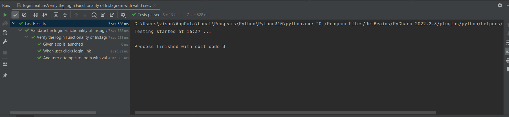
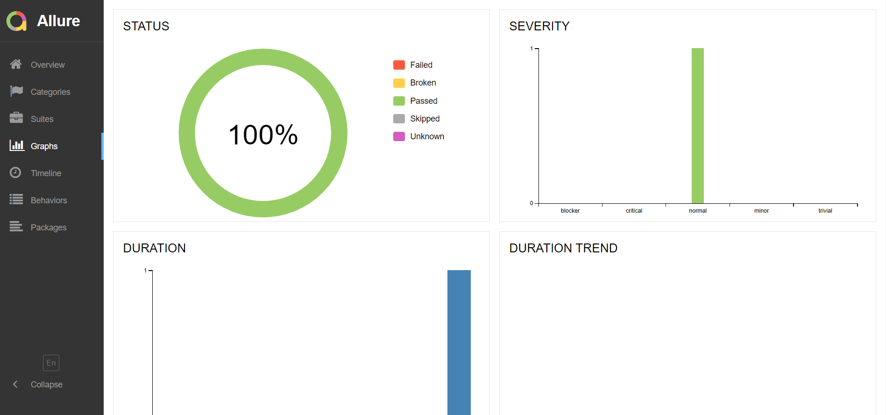

# Instagram Mobile App Automation

This project contains Login page automation for instagram app.
Appium, Behave bdd test framework and python is used for implementation

* please note: the currently used version for python is 3.10.
* Install requirements before executing the scripts
  file before running the script.
* Mobile/Simulator should be connected to the device if you are running in real device/simulator
* Need to mention username and password in `constants/authentication.py` file before running the script

# How to Run script in browserstack

* Create browserstack account and get your username and access key

* Run the below command to upload you app into browserstack

`curl -u "username:key" -X POST "https://api-cloud.browserstack.com/app-automate/upload" -F "file=@/path/to/apk/file"`

* Ensure that @ symbol is prepended to the file path in the above request. A sample response for the above request is shown below:

`{
    "app_url" : "bs://j3c874f21852ba67vhgsaghfdc33f47514288c4ba4"
}
`
* Please note the app_url value returned in the API response (bs://j3c874..... in the above example). We will use this value to set the application under test while configuring the test later on.

* Add username and access key in `behave.ini`

* Add the response url getting from above steps in `app` capability in `browserstack.json` file

* Change the below configurations in `behave.ini`
`
env=browserstack
platform=Android
`

# How to run test?

* Give the environment (browserstack/mobile), platform (Android/iOS), appium host, port etc to the `behave.ini` file
* All the desired capabilities should be given in `browserstack.json` or `mobilecapabilities.json` file
* If you running in real device or simulator get the device id using `adb device` command and give it in `mobilecapabilities.json` file

1. Via Terminal

    * Run `behave --tags=@{specific_tag}`
    * Run `behave --tags={tag1,tag2}`
    * Run `behave <path to feature file>`

2. Via PyCharm
    * Run directly from the feature file

3. Run Script with allure reporting
   * Run `behave -f allure_behave.formatter:AllureFormatter -o <path to result>`
   * Then Run `allure serve`
   
   
# Folder Structure

	.
	├── root
	│     ├── steps                                 # Step definitions
	│     │     ├── common_steps.py
	│     │     └── login_steps.py
	│     ├── features
	│     │     └── login.feature                   # Test scenarios
	│     ├── pages                                 # Page objects and methods
	│     │     ├── android
    │     │     │     └──login_page.py
	│     │     ├── ios
    │     │     │     └──login_page.py.py
	│     │     └── base
    │     │          └──base_page.py
    │     ├── config                    
    │     │    ├── constants
	│     │    │      └── authentication.py
    │     │    ├── driver
	│     │    │      └── driverfactory.py
    │     │    ├── base_config.py
    │     │    ├── browserstack.json                   #browserstack configurations 
    │     │    └── mobilecapabilities.json             # mobil configurations
    │     ├── environment.py                                # Hooks
    │     ├── requirement.py                                #Required Libraries
    │     ├── app                    
    │     │     └──android                                  #apk file
    │     │     └──ios                                  
    │     └── behave.ini                                    # App configuration details

# Output

